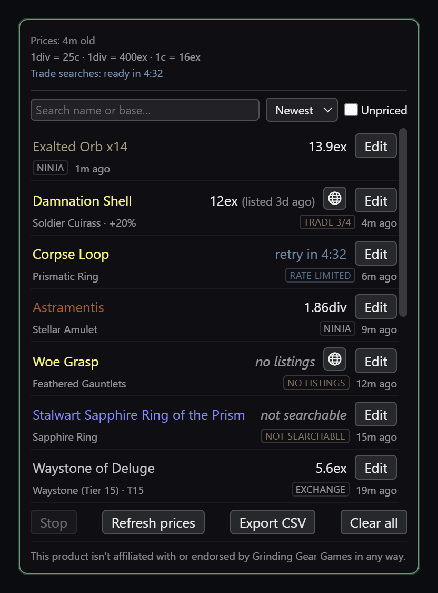
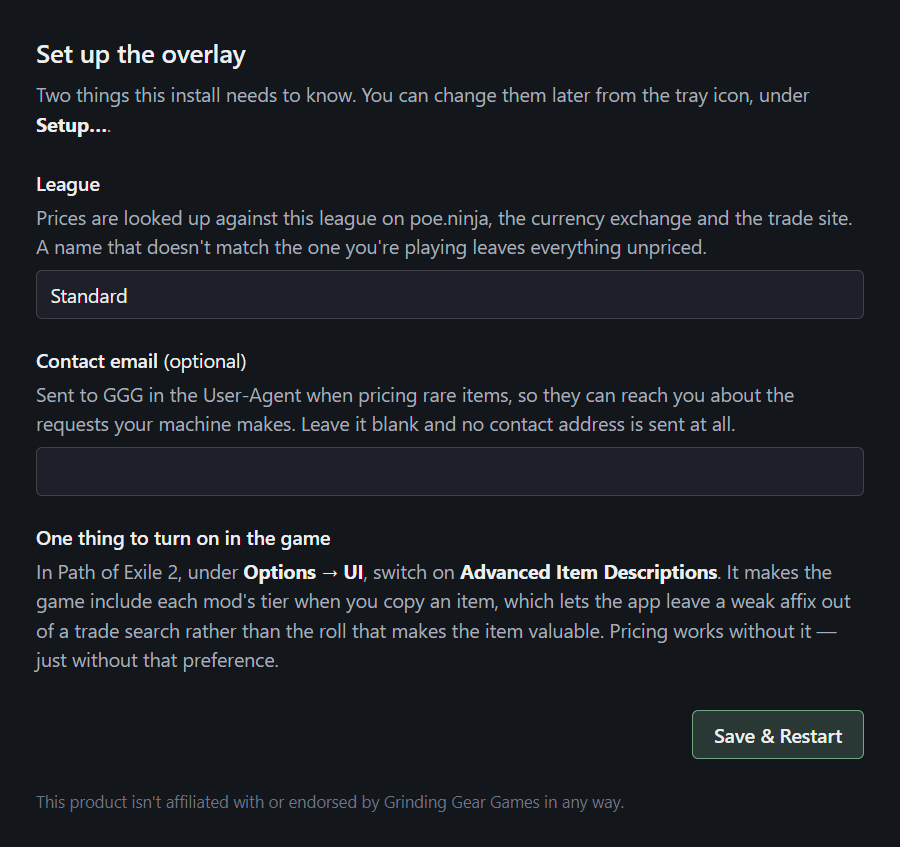
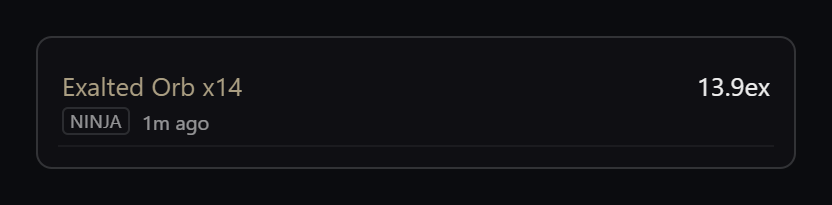
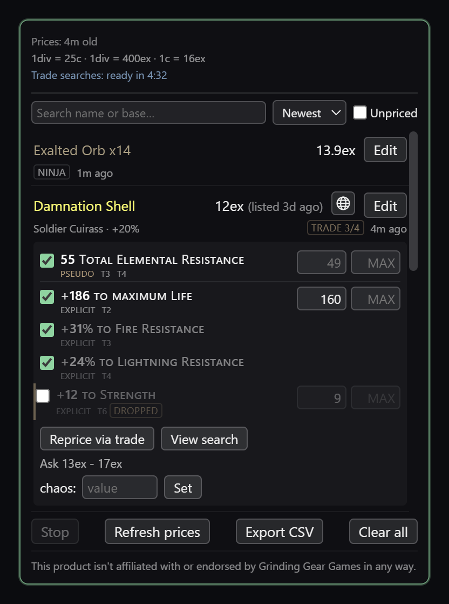
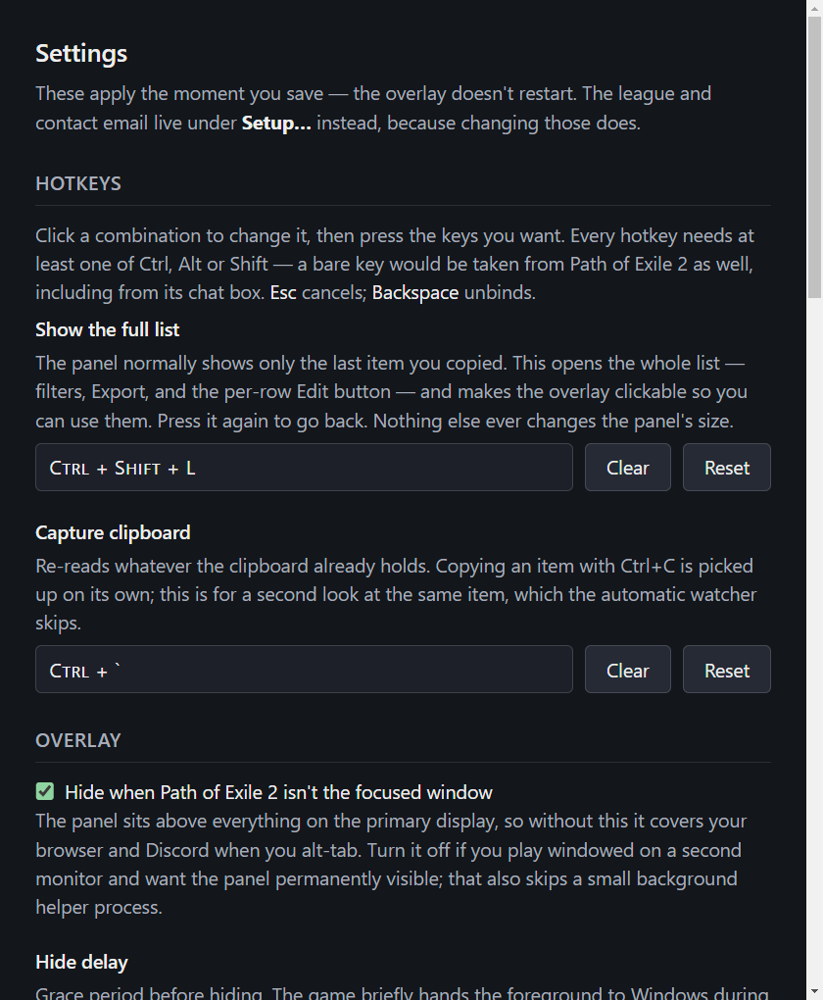

# PoE2 Loot Value Overlay

[](https://github.com/atakocabas/poe2-loot-value-overlay/releases)
[](https://github.com/atakocabas/poe2-loot-value-overlay/actions/workflows/ci.yml)
[](#install)
[](LICENSE)

**Ctrl+C an item in Path of Exile 2 and this tells you what it's worth.** A small overlay sits in the
corner of the game, prices whatever you copy against poe.ninja, GGG's currency exchange and the trade
site, and keeps every drop in one searchable list you can total up afterwards.

<p align="center">
  
</p>

<sup>Screenshots are the real panel, drawn from sample loot — see
[scripts/screenshots.js](scripts/screenshots.js).</sup>

This product isn't affiliated with or endorsed by Grinding Gear Games in any way.

## Install

Windows only. Grab either download from the
[Releases page](https://github.com/atakocabas/poe2-loot-value-overlay/releases):

- **`PoE2 Loot Value Overlay Setup <version>.exe`** — the installer. Lets you choose an install
  directory and adds a Start Menu entry.
- **`PoE2 Loot Value Overlay <version>.exe`** — portable. Run it where it sits; nothing is installed.
  Both share the same settings and loot cache in `%APPDATA%/poe2-loot-value-overlay/`.

Neither is code-signed, so Windows SmartScreen warns before it runs — *More info* → *Run anyway*.
Expect that on **every** release: SmartScreen tracks reputation per exact file, and an unsigned new
version carries nothing over from the last. If you'd rather not trust a binary,
`npm run package` builds exactly these two files from this source.

The app checks GitHub for a newer release at startup and every six hours, and says so in the tray
menu and the panel header. **It never downloads or installs anything** — updating means fetching the
new exe yourself. Set `updates.checkForUpdates` to `false` to switch the check off.

## First run

Two things can't ship as a working default, so the app asks once. Reopen this any time from the tray
icon's **Setup…**.

<p align="center">
  
</p>

- **League** — every price source is queried per league, and leagues rotate every few months. A name
  that doesn't match the one you're playing isn't an error anywhere; it just leaves everything
  unpriced.
- **Contact email** *(optional)* — sent to GGG in the `User-Agent` when pricing rares, so they can
  reach the person whose machine is making the requests. Blank sends no contact address at all.

Saving from the tray restarts the app: the league is read at startup by three separate pricing
clients, and half-applying it would be worse than a restart.

## Using it

The panel has **two forms**, and one hotkey moves between them. It rests as a heads-up display —
the last thing you pressed Ctrl+C on and nothing else, about 70–90px tall, passing every click
through to the game:

<p align="center">
  
</p>

**`Ctrl+Shift+L` opens the full list** — the panel at the top of this page — and makes it clickable
in the same keypress, so the per-row **Edit** button works straight away. Press it again to go back.
**Nothing else ever changes the panel's size**: it stays exactly as you left it until you press the
key again.

| hotkey | default | does |
| --- | --- | --- |
| `toggleList` | `Ctrl+Shift+L` | Opens the full list *and* makes the overlay clickable, so Edit works. Again closes both. |
| `forceCapture` | `Ctrl+\`` | Re-reads the clipboard even if it hasn't changed. |

In the full list:

- **Every drop ever captured, newest first.** Identical stacks fold into one row ("Exalted Orb x14"),
  and the list is searchable, sortable by value/time/name, and filterable to unpriced items. Hovering
  a row shows the item's full text.
- **Under the list**: *Stop* abandons a lookup in flight (a trade search can sit on a rate-limit
  lockout for half an hour), *Refresh prices* forces the poe.ninja pull that otherwise runs on a
  timer, *Export CSV* writes the whole list out, and *Clear all* is the only way to wipe it —
  two-step, the second press confirms.
- **Edit** on any row opens the mods the search used, a **Reprice via trade** button, **View search**
  to open the same query on the trade site, and a box to type a price in yourself.

The overlay hides itself when Path of Exile 2 isn't the focused window, and stays hidden entirely
until it sees the game running. Panel size, side, display currency and the hotkeys are all in the
tray's **Settings…**; everything else is in [docs/configuration.md](docs/configuration.md).

| A row's **Edit** panel | The tray's **Settings…** |
| --- | --- |
|  |  |
| The ticked mods are the ones the price rests on; `dropped` marks one the search had to shed to find a market at all. | Applies the moment you save — no restart. |

## How prices are found

Each captured item is tried against three sources in order:

1. **poe.ninja** for currency, uniques and everything else it publishes.
2. **GGG's currency exchange** when poe.ninja has no price or its data has gone stale — hourly
   aggregate history, so it can't price rares.
3. **GGG's trade API** for rares and high-level white bases, which nothing else covers.

**A trade price is a floor, not an appraisal.** It's the cheapest of the five cheapest listings
matching your item, and PoE2's cheap end is a wall of dump listings — measured on one real jewel, the
app reported 1 exalted while sellers of the same thing were asking around 30. Read it as *"I could
move this quickly for about X"*. The parenthetical after the price says how old that cheapest listing
is, because a floor nobody has bought at for three days is a different fact from a fresh one.

Some rares come back unpriced, and the row says which kind of "no price" it hit — they ask completely
different things of you. Hover the badge for the specifics.

| badge | what happened | what to do |
|---|---|---|
| **rate limited** | The search budget was spent, so no lookup went out | Wait for the window, then Reprice |
| **prices loading** | poe.ninja's first refresh hadn't finished yet | Reprice now that prices are in |
| **search failed** | The search went out and broke — an HTTP error or a dropped connection | Reprice to try again |
| **no listings** | The search ran; the market has nothing matching | Nothing — repricing gives the same answer |
| **no chaos price** | Listings exist, but none quoted a convertible currency | Open the trade search and look |
| **not searchable** | A Magic item, with nothing reliable to search on | Price it by hand |
| **search skipped** | A setting says not to search items like this one | Change that setting, or price by hand |
| **no price data** | Not in poe.ninja and not on the currency exchange | Price it by hand |

The first three are shown in a cooler blue: those resolve on their own. The rest are the market's
answer, and repricing will not change them.

GGG rate-limits the trade API **per IP**, so the app budgets well under the published limits and
**declines** a lookup rather than queueing it when the budget is spent — otherwise one rare stalls
every currency drop behind it. The panel header and each affected row count down to when the budget
refills, and **nothing is retried automatically**: a map's worth of rows all firing at once would
just exhaust it again, so pressing Reprice stays your decision.

The full reasoning — the measured listing counts, the mod-drop ladder, how armour and waystones are
searched, and the rate-limit arithmetic — is in
[docs/pricing-trade2.md](docs/pricing-trade2.md).

## Is this allowed?

Yes, and deliberately so. GGG's [developer API policy](https://www.pathofexile.com/developer/docs)
permits an "executable app that runs independently from the game", and every endpoint this app
touches is public and unauthenticated — no account, no OAuth, no client id, no token. Capture is
PoE2's own Ctrl+C: the app watches the clipboard for changes and never registers that combination as
a hotkey, so the game always receives the keystroke. **Nothing modifies game files, reads game
memory, or automates any input toward PoE2.** Requests to GGG carry an app-identifying `User-Agent`
and go through the rate limiting described above.

The endpoint-by-endpoint version is in [docs/pricing-trade2.md](docs/pricing-trade2.md).

## Documentation

| | |
|---|---|
| [docs/configuration.md](docs/configuration.md) | Every `settings.json` key and what it does |
| [docs/pricing-trade2.md](docs/pricing-trade2.md) | GGG API compliance, trade search, rate limits |
| [docs/pricing-sources.md](docs/pricing-sources.md) | poe.ninja, the currency exchange, the pricing queue |
| [docs/renderer.md](docs/renderer.md) · [docs/main-process.md](docs/main-process.md) · [docs/parser.md](docs/parser.md) | How the app is put together |
| [CLAUDE.md](CLAUDE.md) | Start here before changing anything |

## Development

```bash
npm install
npm run dev          # the iterative loop: rebuild and restart the app on every change
npm test             # parser/pricing/db unit tests
npm start            # run the overlay
npm run screenshots  # redraw the images above from the real renderer
npm run package      # produce a Windows installer + portable exe (see release/)
```

Packaging needs Windows Developer Mode enabled — electron-builder's `winCodeSign` step creates
symlinks and fails with a privilege error without it.

## License

[MIT](LICENSE).
